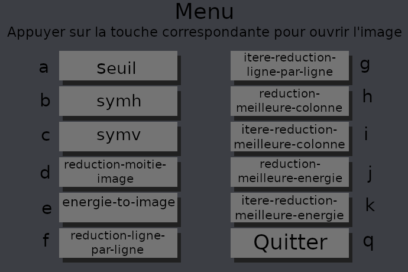

# ocaml-image-transformation
Ce projet a été fait a partir d'un devoir d'informatique du lycée Thiers

Les fonctions ecrites permettent de manipuler des matrices d'images en noir et blanc  et d'ecrire des fonctions pour effectuer des transformations sur les images

Des images de test `flamantNB.png` , `guepiersNB.png` et `rueNB.png` sont mis a disposition pour tester les fonctions 


# Installation des modules Ocaml

Pour utiliser et compiler ces programmes il faut d'abord installer les modules necessaires

Pour ce faire :
```sh
$ opam install graphics camlimages
```


# Utilisation de l'interface graphique

J'ai conçu une interface graphique simple pour pouvoir passer entre les différentes transformations d'image plus facilement voici comment s'en servir.

1. Compiler le code a l'aide de  `$ make tests`
2. Puis l'executer avec `$ ./tests <le_nom_de_limage>`
3. Ensuite il faut juste taper sur le clavier la lettre correspondant à la transformation souhaitée à l'affichage du menu 

Par exemple appuyer sur la touche "a" va afficher l'image rentrée en argument avec la tranformation par la fontion seuil


 Voici a quoi ressemble le menu :



